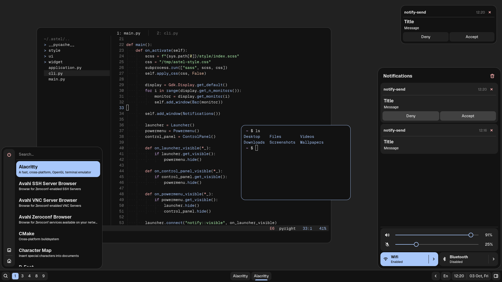

<p align="center">
    
</p>

### Dependencies
```
gtk3
dbus-glib
python-dbus
python-gobject
pipewire
wireplumber
pipewire-pulse
networkmanager
bluez
bluez-utils
hyprland
dart-sass
libastal-bluetooth-git
libastal-hyprland-git
libastal-network-git
libastal-notifd-git
libastal-tray-git
libastal-wireplumber-git
```

### Usage

Clone repo:
```bash
git clone https://github.com/btvtkh/astel-shell.git
```

To start shell run `main.py`:
```bash
python ~/astel-shell/main.py
```

To message shell use `cli.py`:
```bash
# Toggle window by name, for example launcher
python ~/astel-shell/cli.py -m 'toggle Launcher'

# Quit shell
python ~/astel-shell/cli.py -q
```